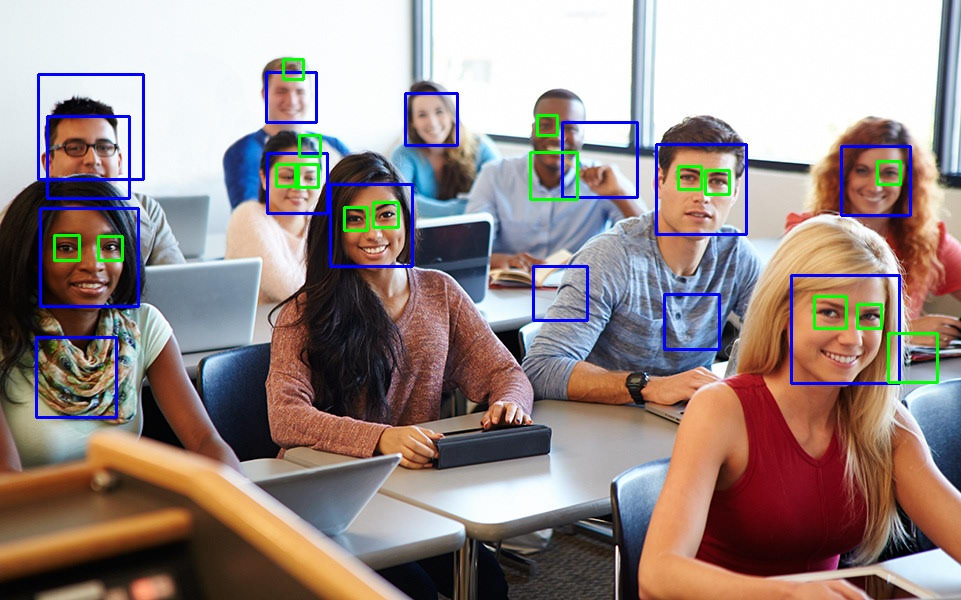
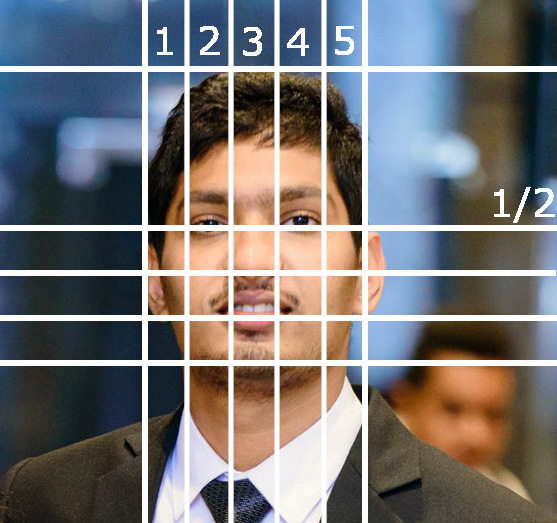
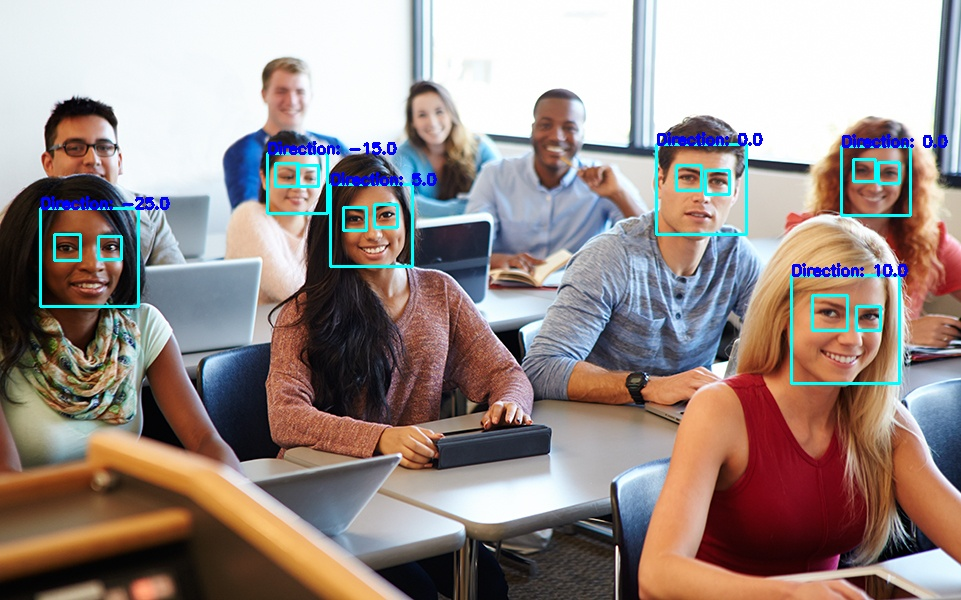

# Multi Gaze Interactions - Docs

Multi Gaze Interactions application provides multi-user gaze tracking, which can be used with any standard camera in real-time. The application includes a pre-trained model using [Columbia Gaze Dataset](http://www.cs.columbia.edu/CAVE/databases/columbia_gaze)
for gaze prediction and Haar cascade filters for face and facial features detection.  

In the initial step of facial features detection, the Haarcascade filters was used. However, theHaar cascade filters tend to produce higher number of falsepositives for a given image. The image below depicts the samples of facial features that are miss identified by using only the filters. There multiple misidentified items in the image, such as the scarf on a woman on the left are identified as a face. Another example is a part of the hair of a woman in the front that is mistaken for an eye. 
  

The Artistic Heuristics can assist in getting rid of false-positives or at least reducing the number of false-positives.  Facial detection using Artistic Heuristics is a method of using relative location to determine facial features. By drawing vertical lines over a face by equally splitting a human face into five sections, the site of eyes in a human face should be between the 1/5th, 4/5th lines, and they must be next to the mid-line as illustrated in the below image.   
    

After applying the Artistic Heuristics technique, the number of false-positive is reduced significantly, as portrayed in the image beneath.   
  

The Multi Gaze Interactions was written solely in Python3. Therefore, if the users have Python installed already on the machine, it is a matter of a couple of command lines the Multi Gaze Interactions application is ready to be used. To run the application, the users need to connect their webcams and enter a command for the Python code to run. 

Source : [https://github.com/nirdslab/multigazeinterations](https://github.com/nirdslab/multigazeinterations)

## Online Demo

Through online demo, gaze information for a image can be obtained for a given image.

Online Demo: [https://mgaze.nirds.cs.odu.edu/](https://mgaze.nirds.cs.odu.edu/)
  
  
## Desktop Demo Application
  * The application that tracks the multi-users gaze compatible with any standard webcams  
  * Less initial calibration  
  * Reduce the number of false positive detections with the application of Haar cascade filters and artistic heuristics  
  * Easy to install with just a few command lines  

## Running the Python code from Source
The users may run the Multi Gaze Interactions application from any machine. However, there are a couple of requirements that need to be met in advance. Since, the application was implemented using Python3, and it requires the machine to have **Python 3.7** or  higher installed. It also requires **'pip' version 19.3 or higher**. 

### Step by step instructions
**1. Get the source code**  
There are 2 ways to obtain the source code for the application, which are :     
  * Downloand the zip file from [our respository](https://github.com/nirdslab/multigazeinterations)  
  * Clone the source code from Git repository by entering the below commamnd line.   

```shell 
git clone https://github.com/nirdslab/multigazeinterations.git
```

#### Install Dependencies
The application requires some dependencies in which they can be installed by using the below command line.   

```shell 
pip3 install -r requirements.txt 
```

#### Runnning Application
Once the users make sure that webcam is appropriately connected, they are ready to run the Python code using the below command in order to use the Multi Gaze Interactions application in real-time. 
```shell
# Realtime Gaze tracking with webcam (or equivalent)
python realtime.py 
```
For testing purposes, the users may use this application on any images.  The code block below illustrates the commands needed. Though, the users require to specify the proper image path.   
```shell 
# Testing gaze tracking on images
python image_test.py <image path>
```  
For example,  if the users want to use the image name `test.jpg`, the users need to enter  `python image_test.py test.jpg` to the command prompt.  

## API Usage


## About Us
